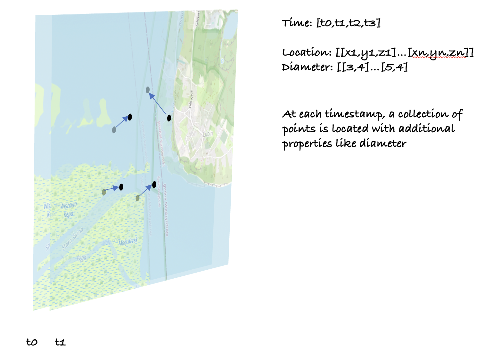

Tracking particles is a scenario used in the Oil Spill and Water Pollution Iliad pilots[TODO references]

In this scenario, starting from the discrete model of the particles like microplastic or oil drops.

Commonly used models like OpenDrift generate data in the NetCDF file with a data frame with dimensions:
 - Trajectory - representing particles
 - Time - timestamps of the snapshots
 In this representation It is useful to think about the snapshots first. In each snapshot particles have new location and depth + new values of the other properties.
 Particles are tracked in the model and they are of specific type like oil, microplastic etc.

 

In this scenario we're interested in the collection of tuples with variables as the function of time:

* lon, type: float32, dims: ('trajectory', 'time'), shape: (1000, 73)
* lat, type: float32, dims: ('trajectory', 'time'), shape: (1000, 73)
* z, type: float32, dims: ('trajectory', 'time'), shape: (1000, 73)
* dimension, type: int32, dims: ('trajectory', 'time'), shape: (1000, 73)
* particle_class, type: int32, dims: ('trajectory', 'time'), shape: (1000, 73) #enum fo Oil droplet, Microplastic, Codepod)

Client application shall be able to query data with given Area of Interest and time range.
The API could looks like following:
```
\ - root endpoint with list of collections including our particle monitoring data, contains all the next level links
\conformance - technical declaration of the API conformance
\collections - list of DATASETS
\collection\particle_monitoring_for_x - collection with properties layers, root to query data_access_api
\collection\particle_monitoring_for_x\cube - main endpoint query data with:
  2/3 dimensional bbox and
  time according
  see [Cube Query EDR spec](https://docs.ogc.org/is/19-086r6/19-086r6.html#_fe30ac95-7038-4dd1-902d-f4fcd2f31c8d)
```

In the coverageJSON, it could be represented as the:
* CoverageCollection domainType="Trajectory" - but all the trajectories would share the time dimension, which is redundant. also traveling though them by time would require to open each for each timestamp.
* CoverageCollection domainType="MultiPoint" - each MultiPoint at a given time, probably better as we're interested in the snapshots, example file attached:
[Snapshots of the MultiPoint](MultiTrajectories.json)

Properties and rangeset definition is shared for the whole data accessed:
```
"parameters" : {
  "diameter": {
    "type" : "Parameter",
    "description" : {
      "en": "particle diameter"
    },
    "unit" : {
      "label": {
        "en": "nanometers"
      },
      "symbol": {
        "value": "nm",
        "type": "http://www.opengis.net/def/uom/UCUM/"
      }
    },
    "observedProperty" : {
      "id" : "https://qudt.org/vocab/unit/NanoM",
      "label" : {
        "en": "0.000000001-fold of the SI base unit metre"
      }
    }
  },
  "particle_class": {
    "type" : "Parameter",
    "observedProperty" : {
      "id": "http://example.com/particletypes",
      "label" : {
        "en": "Particle class"
      },
      "categories": [{
        "id": "http://example.com/particletypes/0",
        "label": {
          "en": "Oil droplet"
        }
      }, {
        "id": "http://example.com/particletypes/1",
        "label": {
          "en": "Microplastic"
        }
      }, {
        "id": "http://example.com/particletypes/2",
        "label": {
          "en": "Codepod"
        }
      }]
    },
    "categoryEncoding": {
      "http://mmisw.org/ont/argo/qualityFlag/_0": 0,
      "http://mmisw.org/ont/argo/qualityFlag/_1": 1,
      "http://mmisw.org/ont/argo/qualityFlag/_4": 2
    }
  }
},
  "referencing": [{
    "coordinates": ["x","y"],
    "system": {
      "type": "GeographicCRS",
      "id": "http://www.opengis.net/def/crs/OGC/1.3/CRS84"
    }
  }, {
    "coordinates": ["z"],
    "system": {
      "type": "VerticalCRS",
      "cs": {
        "csAxes": [{
          "name": {
            "en": "Pressure"
          },
          "direction": "down",
          "unit": {
            "symbol": "Pa"
          }
        }]
      }
    }
  }, {
    "coordinates": ["t"],
    "system": {
      "type": "TemporalRS",
      "calendar": "Gregorian"
    }
  }],
```

Then for each snapshot fully described data for 2 particles/trajectories:
```
{
  "type" : "Coverage",
"domain" : {
  "type" : "Domain",
  "axes": {
  "t": { "values": ["2008-01-01T04:00:00Z"] },
  "composite": {
    "dataType": "tuple",
    "coordinates": ["x","y","z"],
    "values": [
      [1, 20, 1],
      [2, 21, 3]
    ]
  }
}
},
"ranges" : {
  "POTM" : {
    "type" : "NdArray",
    "dataType": "float",
    "shape":[2],
    "axisNames": ["composite"],
    "values" : [ 23.8, 23.8 ]
  },
  "particle_class" : {
    "type" : "NdArray",
    "dataType": "integer",
    "shape":[2],
    "axisNames": ["composite"],
    "values" : [ 1, 3 ]
  }
}
},
```
The more particles, the longer are 'values' tables. rest remain constant.

CoverageJSON does not say if CoveragCollection can have domain, but the Collection does not specify order nor the domain of timestamps otherwise, so the proposed encoding add CoverageCollection level domain that specify the values for the constants within the coverages - time in this case.

```
"domain":{
  "type" : "Domain",
  "axes": {
  "t": { "values": ["2008-01-01T04:00:00Z","2008-01-02T04:00:00Z"] }
  }
}
```

Now, client application can lookup the time domain and present snaphot one by one or skip to the prticular nearest needed time.
