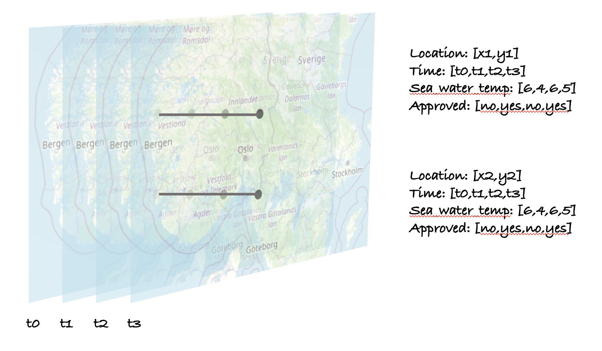

Herein representation is the example how the data from in-situ sensors data can be exposed with standardised API and formats.

This representation is good for measurements in constant locations.


[NCEI template](https://www.ncei.noaa.gov/data/oceans/ncei/formats/netcdf/v2.0/index.html) defines it as timeSeriesProfile. CoverageJSON specification defines [PointSeries](https://docs.ogc.org/cs/21-069r2/21-069r2.html#_8962dcde-77d5-426d-8eeb-ca2c168a0bee) type.
[Todo: Zarr equivalent]

These formats represent data as multidimentional grids of values. area and time for which values can be readed is called domain (analogous to mathematical function domain). Likewise, range is the set of values.
The dimensions of the time series for one point are:
* x - longitute - single value for each point
* y - latitude - single value for each point
* z - height/depth - optional, single value for each point
* t - sampleing time - a list of values


# One point, shared sampling timestamps
In the CoverageJSON, they are defined as 'domain':
```
"domain": {
    "type": "Domain",
    "domainType": "PointSeries",
    "axes": {
        "x": {
            "values": [
                11.6646684
            ]
        },
        "y": {
            "values": [
                58.9355841
            ]
        },
        "t": {
            "values": [
                "2023-05-01T02:25:00.220884Z",
                "2023-05-01T02:25:00.495122Z",
            ]
        }
    },
    "referencing": [
        {
            "coordinates": [
                "x",
                "y"
            ],
            "system": {
                "type": "GeographicCRS",
                "id": "http://www.opengis.net/def/crs/OGC/1.3/CRS84"
            }
        },
        {
            "coordinates": [
                "t"
            ],
            "system": {
                "type": "TemporalRS",
                "calendar": "Gregorian"
            }
        }
    ]
},
```
CoverageJSON convention define x,y,z as spatial axes and t as time axis, so the definition of dimentions are given by standard.
The values of measurements are stored separately in the ranges. it includes reference to the axis names defined in domain. Shape defines the cube - at this case it is 1-dimentional table at given location and values being a function of t (time) only.
```
"ranges": {
    "sea_water_temperature": {
        "type": "NdArray",
        "dataType": "float",
        "axisNames": [
            "x",
            "y",
            "t"
        ],
        "shape": [
            1,
            1,
            82
        ],
        "values": [
            6.526,
            6.5265]
     }
}
```
Name of the range (here 'sea_water_temperature') is at the same time reference to the 'properties' definitions.
The properties definition can be common for the whole payload or collection and is attached to both.
```
"sea_water_temperature": {
    "type": "Parameter",
    "id": "sea_water_temperature",
    "description": {
        "en": "Sea water temperature is the in situ temperature of the sea water"
    },
    "observedProperty": {
        "id": "http://vocab.nerc.ac.uk/standard_name/sea_water_temperature/",
        "label": {
            "en": "Sea Water temperature"
        }
    },
    "unit": {
        "label": {
            "en": "degree_Celsius"
        },
        "symbol": {
            "value": "Cel",
            "type": "float"
        }
    },
    "properties": {
        "madeBySensor": "SensorURI?"
    }
}
```


NetCDF equivalent CDL part:
```

Dataset {
    Int32 timeSeries[timeSeries = 1];
    Float64 time[time = 2];
    Float64 lat[timeSeries = 1];
    Float64 lon[timeSeries = 1];
    Grid {
     ARRAY:
        Float64 sea_water_temperature[timeSeries = 1][time = 2];
     MAPS:
        Int32 timeSeries[timeSeries = 1];
        Float64 time[time = 2];
    } sal;
    Grid {
     ARRAY:
        Float64 temp[timeSeries = 1][time = 10];
     MAPS:
        Int32 timeSeries[timeSeries = 1];
        Float64 time[time = 2];
    } temp;
    String instrument1;
    String platform1;
    Float64 crs;
} example/v2.0/NCEI_timeSeries_template_v2.0_2016-09-22_181830.715665.nc;
```

lat, lon and time dimentions are followin the CF convention. In addition together with CDL, these define the shape of the domain formally refering to the 'latitude' 'longitude'.
stadnard_names shall be defined in the vocabulary the metadata is based on, but the formal link does not exist yet
```

float latitude;
*:long_name = "station latitude" ;
*:standard_name = "latitude" ;
*:units = "degrees_north" ;
*:_CoordinateAxisType = "Lat" ;
*:axis = "Y" ;

float longitude;
*:long_name = "station longitude" ;
*:standard_name = "longitude" ;
*:units = "degrees_east" ;
*:_CoordinateAxisType = "Lon" ;
*:axis = "X" ;

float elevation;
*:long_name = "Elevation above mean seal level" ;
*:standard_name = "height_above_mean_sea_level" ;
*:_CoordinateAxisType = "Z" ;
*:units = "m" ;
*:axis = "Z" ;
```

# Multiple points, shared sampling timestamps
In case of different points sharing the sampling timestamps, spatal dimensions are turned into composites like in the MultiPointSeries [example](https://docs.ogc.org/cs/21-069r2/21-069r2.html#_02f1c364-8655-4fb4-aaab-03a9858d30fb) or [NCEI_TimeSeriesProfile_OrthogonalVertical_IncompleteTemporal](https://www.ncei.noaa.gov/data/oceans/ncei/formats/netcdf/v2.0/timeSeriesProfileOrthoVIncomT.cdl)NetCDF equivalent.

# Multiple points, independent sampling timestamps

Time dimmention is always simple type, one dimentional list. Therefore, in case each station is sampling with own trigger/clock, domain definition is different. Amid there is a NCEI template for this case, it is recommended to store the data in separate files to eliminate null values. im CoverageJSON, the case can be supported by CoverageCollection with each coverage having own domain. Properties definition shared between like in the given [example](PointSeries_sintef.covjson)
